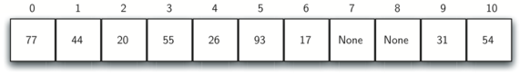
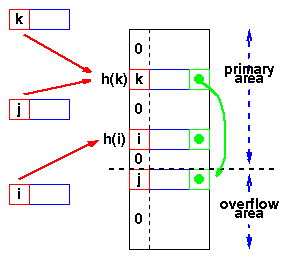

<div align="right">

</div>

# TDA HASH

## Repositorio de Didier Erik Watson - 96064 - dwatson@fi.uba.ar

- Para compilar:

```bash
make all
```

- Para ejecutar:

```bash
./pruebas_alumno || ./pruebas_chanutron
```

- Para ejecutar con valgrind:
```bash
make valgrind-alumno || make valgrind-chanutron
```
---
# Diccionario

En programación, un diccionario es una estructura de datos que permite almacenar y organizar información en pares clave-valor. Cada elemento en un diccionario consiste en una clave única y un valor asociado. La clave funciona como un identificador único y se utiliza para acceder al valor correspondiente.

Los diccionarios son extremadamente útiles cuando se necesita buscar, recuperar y modificar rápidamente datos basados en una clave. Son similares a los diccionarios en el mundo real, donde se puede buscar palabras y obtener sus definiciones. En el caso de los diccionarios de programación, en lugar de definiciones, se almacenan valores relacionados con las claves.

La implementación de un diccionario puede variar según el lenguaje de programación, pero en general, proporcionan operaciones eficientes (O(1)) de inserción, eliminación y búsqueda de elementos utilizando claves.

<div align="center">

</div>

# Función de Hash
La implementación de un diccionario se basa en una función de hash, que toma un valor de entrada (como una cadena, número u objeto) y lo transforma en un valor hash, que es generalmente un número entero. Su propósito principal es mapear datos de tamaño variable a datos de tamaño fijo de manera determinística.

Una buena función de hash debe tener las siguientes propiedades:

* Uniformidad: Debe distribuir los valores de entrada de manera uniforme para minimizar las colisiones.
* Eficiencia: Debe calcularse de manera eficiente para no generar retrasos significativos en las operaciones que lo utilizan.
* Determinismo: Para un mismo valor de entrada, siempre debe producir el mismo valor hash.
* Resistencia a colisiones: Debe ser poco probable que dos valores distintos produzcan el mismo valor hash.

<div align="center">

</div>

# Tabla de Hash

Una tabla de hash, es una estructura de datos que permite almacenar y recuperar información de manera eficiente. Su funcionamiento se basa en el uso de una función de hash, que asigna una clave un valor dentro de la tabla.

En una tabla de hash, los datos se organizan en una matriz (o arreglo) de tamaño fijo, donde cada elemento se denomina "casilla". La función de hash toma la clave como entrada y calcula un índice correspondiente dentro del rango de las casillas disponibles. Luego, el valor asociado a la clave se almacena en esa posición de la tabla.

Una de las ventajas principales de las tablas de hash es su alta velocidad de búsqueda y recuperación de datos. Dado que la función de hash permite obtener directamente la posición en la tabla donde se encuentra el valor deseado, el acceso a la información es muy rápido, en promedio, con un tiempo de búsqueda constante (O(1)) (Si la función de hash está bien implementada).

Sin embargo, es importante destacar que en ciertos casos, puede ocurrir una colisión de hash. Esto sucede cuando dos claves diferentes generan el mismo índice de casilla. Para manejar estas colisiones, existen diferentes técnicas, como la resolución por encadenamiento (donde se almacenan múltiples valores en una misma casilla usando una lista enlazada) o la resolución por sondeo (probing) lineal o cuadrático, (donde se busca la siguiente casilla disponible), o la resolución por zona de desborde.

## Probing lineal

Es una técnica utilizada para resolver colisiones en una tabla hash. Cuando se produce una colisión, es decir, cuando dos claves diferentes generan el mismo índice de casilla, el sondeo lineal busca la siguiente casilla disponible de forma secuencial hasta encontrar un espacio vacío donde se pueda almacenar el valor.

La idea básica del sondeo lineal es que si una casilla está ocupada, se avanza secuencialmente a la siguiente casilla y se verifica si está disponible. Esto se hace aplicando una función de incremento a la posición actual y verificando cada casilla sucesiva hasta encontrar una vacía.

El sondeo lineal puede presentar algunos problemas, como la formación de agrupaciones o agrupamientos (clustering). Esto ocurre cuando se producen colisiones repetidas y se forman secuencias de casillas ocupadas consecutivas. El agrupamiento puede afectar el rendimiento de las operaciones de inserción y búsqueda, ya que aumenta la probabilidad de futuras colisiones.

<div align="center">

</div>

## Probing cuadrático

En lugar de buscar la siguiente casilla disponible de forma lineal, el sondeo cuadrático utiliza una función de incremento cuadrático para calcular las siguientes posiciones a revisar en caso de colisión. La función de incremento cuadrático se basa en un polinomio cuadrático y permite explorar las casillas de forma más dispersa en comparación con el sondeo lineal.

Al igual que con el sondeo lineal, el sondeo cuadrático puede presentar problemas de agrupamiento, donde las colisiones repetidas pueden generar agrupamientos de casillas ocupadas consecutivas


<div align="center">

</div>

## Encadenamiento

El hash con encadenamiento, es una técnica utilizada para resolver colisiones en una tabla hash. A diferencia del sondeo lineal o cuadrático, en el hash con encadenamiento se permite que varias claves colisionen y se almacenen en la misma posición de la tabla.

En lugar de reemplazar o desplazar el valor existente en caso de una colisión, se utiliza una estructura de datos adicional, como una lista enlazada, para almacenar múltiples valores asociados a la misma posición de la tabla hash.

Cuando se realiza una búsqueda o recuperación de un valor, se utiliza la función de hash para calcular el índice correspondiente y se busca en la lista enlazada asociada a esa posición.

El hash con encadenamiento ofrece varias ventajas. En primer lugar, permite almacenar múltiples valores asociados a una misma posición de la tabla, lo que es especialmente útil en caso de colisiones frecuentes. Además, esta técnica proporciona una resolución flexible de colisiones sin necesidad de realizar movimientos o ajustes en la estructura de la tabla hash.

Sin embargo, también hay consideraciones a tener en cuenta. El espacio requerido para almacenar la estructura adicional, como las listas enlazadas, puede aumentar el consumo de memoria. Además, la eficiencia de las operaciones de búsqueda y recuperación puede depender del rendimiento de la estructura de datos utilizada para el encadenamiento, como la eficiencia de búsqueda en una lista enlazada.

<div align="center">

</div>

## Zona de desbordamiento

El hash con zona de desborde, es una técnica utilizada para resolver colisiones en una tabla hash. A diferencia del encadenamiento, donde se utiliza una estructura de datos adicional para almacenar múltiples valores asociados a una misma posición, en el hash con zona de desborde se reserva una zona adicional de almacenamiento para manejar las colisiones.

En esta técnica, cada posición en la tabla hash tiene un tamaño fijo y se asigna para almacenar un solo valor (clave-valor). Sin embargo, cuando se produce una colisión, es decir, cuando dos claves diferentes generan el mismo índice de casilla, se utiliza la zona de desborde para almacenar el valor adicional.

Cuando se realiza una búsqueda o recuperación de un valor, se utiliza la función de hash para calcular el índice correspondiente y se busca tanto en la posición de la tabla como en la zona de desborde, si es necesario.

El hash con zona de desborde puede ser útil cuando se espera un número limitado de colisiones y se quiere evitar la utilización de una estructura de datos adicional para el encadenamiento. Sin embargo, el manejo adecuado de las zonas de desborde y el crecimiento de la tabla hash pueden requerir un diseño cuidadoso y una gestión eficiente del espacio de almacenamiento.

<div align="center">

</div>